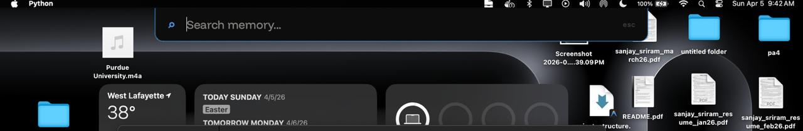
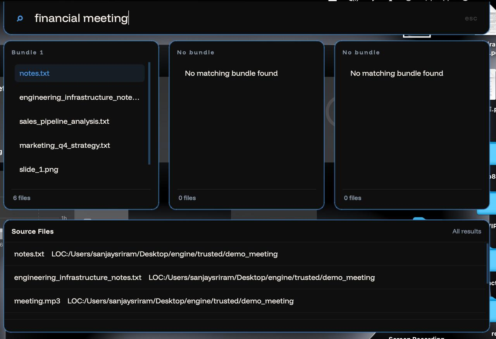

# Sift: Local Semantic Search Engine

<p align="center">
  
</p>

Sift is a high-performance local embedding and retrieval engine designed for instant multimodal semantic search across text, images, audio, and video.

---

## Core Architecture

### 1. Multimodal Core (Qwen3-VL)

The backbone of Sift is **Qwen3-VL-Embedding-2B**, which natively handles text, images, and video.

- **Unified Vector Space**: All modalities are mapped into a shared 2048-dimensional space.

### 2. Audio Bridge (CLAP + Projection)

Unified search for audio is achieved through a CLAP-to-Qwen adapter:

- **Audio Backbone**: `laion/clap-htsat-unfused` (frozen).
- **Projection Head**: A learned 2-layer MLP (512 -> 2048) that aligns CLAP's audio embeddings with Qwen's vision-text space.
- **Training**: Optimized using Contrastive InfoNCE loss on the AudioSetCaps dataset to relate audio features and textual/visual concepts.

### 3. Processing Pipelines

- **OCR Chain**: Uses EasyOCR to extract text from images, which is then embedded via Qwen for semantic search.
- **Transcription Chain**: Uses Faster-Whisper to generate transcripts from audio, which are also embedded via Qwen to provide text-based retrieval of audio segments.

### 4. Watchdog Daemon

Sift includes a real-time filesystem monitor based on the `watchdog` library. It automatically detects new, modified, or moved files within your monitored directories and indexes them instantly.

- **Initial Scan**: On startup, the daemon performs a full scan to catch any changes that occurred while it was offline.
- **Event-Driven**: Uses OS-level file system events (via `inotify` on Linux, `FSEvents` on macOS) for efficient, low-overhead monitoring.
- **Hidden File Filtering**: Automatically ignores hidden files and directories (e.g., those starting with `.`).

---

## Indexing System

Sift uses an incremental indexing strategy to minimize redundant processing and maximize performance:

- **Change Detection**: Uses BLAKE3 hashing to track file modifications and skip unchanged files.
- **Vector Database**: Integrated with Qdrant for high-speed similarity search and persistent storage.
- **Pipelines**: Files are automatically routed to appropriate processing chains based on MIME type and file extension.
- **Source Mapping**: Maintains strict mapping between source paths and vector IDs to allow for re-indexing and deletion.

---

## Search Capabilities

- **Multimodal Retrieval**: Search by natural language to find related text, images, audio recordings, or video clips in a single query.
- **Result Bundling**: Groups similar snippets or related files using a hybrid scoring system that considers embedding similarity, temporal proximity, and filename Jaccard similarity.

---

## Configuration

Sift is configured via a `config.json` file located in your user's configuration directory:

- **Linux**: `~/.config/sift/config.json`
- **macOS**: `~/Library/Application Support/sift/config.json`
- **Windows**: `%APPDATA%\sift\config.json`

### Monitored Directories

You can specify which folders Sift should index by modifying the `monitored_directories` list in your `config.json`:

```json
{
  "monitored_directories": [
    "/home/user/Documents",
    "/home/user/Pictures",
    "/home/user/Videos/clips"
  ]
}
```

By default, Sift will create this file and point it to a `trusted/` folder within the project directory if no configuration exists. (for simple tests)

---

## Project Structure

- `src/daemon.py`: The unified entry point that preloads models, starts the indexer, and launches the UI.
- `src/indexer/`: Core indexing logic, file routing, and database interaction.
- `src/embed/`: Multimodal embedding pipelines (Qwen3-VL, CLAP, Whisper).
- `src/search/`: Similarity search engine and result bundling logic.
- `src/ui/`: PySide6-based desktop application.
- `models/`: Storage for pre-trained model weights.
- `tests/`: Comprehensive test suite for pipelines and components.

---

## User Interface

The project includes a futuristic, minimalist desktop application built with PySide6:

<p align="center">
  
</p>

- **Bundle-Centric Results**: Search results are grouped into up to three top-ranked bundles plus a recognized-entities list.

<p align="center">
  
</p>

### Keyboard Shortcuts

- **`Alt + Space`**: Toggle the search bar visibility (Global shortcut).
- **`Esc`**: Hide the search bar and clear the current query.
- **`Enter`**: Execute a search or open the currently selected file.
- **`Arrow Keys`**: Navigate through result bundles and file lists.

---

## Setup & Installation

### 1. Prerequisites

- Python 3.12 (managed via `uv`)
- Docker (required for running the Qdrant vector database)

### 2. Environment Setup

Clone the repository and install dependencies using `uv`:

```bash
uv sync
```

### 3. Model Weights

Download the required pre-trained weights into the `models/` directory:

```bash
uv run python -c "from huggingface_hub import snapshot_download; snapshot_download(repo_id='Qwen/Qwen3-VL-Embedding-2B', local_dir='models/Qwen3-VL-Embedding-2B')"
```

### 4. Qdrant Deployment

Run the Qdrant vector database locally using Docker:

```bash
docker pull qdrant/qdrant
mkdir -p qdrant_storage
docker run -p 6333:6333 -p 6334:6334 \
  -v "$(pwd)/qdrant_storage:/qdrant/storage:z" \
  qdrant/qdrant
```

Alternatively, use podman based on your system preference.

### 5. System Dependencies (Linux)

Install the following libraries to support the Qt-based UI on Linux systems:

```bash
sudo apt update
sudo apt install -y libgl1 libegl1 libdbus-1-3 libxkbcommon-x11-0 \
  libxcb-cursor0 libxcb-icccm4 libxcb-image0 libxcb-keysyms1 \
  libxcb-randr0 libxcb-render-util0 libxcb-shape0 libxcb-xfixes0 \
  libxcb-xinerama0 libx11-xcb1 libxrender1 libxi6 libxcomposite1 libxtst6
```

---

## Usage

### Indexing Files

To perform a one-time indexing of files in your configured directories:

```bash
uv run python -m src.indexer.run_indexer
```

### Unified Daemon

To run the main daemon that explicitly preloads the shared Qwen model, performs the startup scan, watches for new/modified files, and then launches the desktop UI process:

```bash
uv run python -m src.daemon
```

To run the daemon persistently in the background (even after closing your terminal), use `nohup`:

```bash
nohup uv run python -m src.daemon > daemon.log 2>&1 &
```

Current startup order for the unified daemon:

1. Preload the shared Qwen embedder once.
2. Perform the initial indexing scan of monitored directories.
3. Start the watchdog observer for new and modified files.
4. Launch the PySide6 UI process.

Notes:

- The unified daemon is intended to share the in-process Qwen singleton between indexing and search.
- On Linux/WSL, desktop UI visibility and global hotkey behavior may depend on the host desktop environment and current UI implementation.

If you only want the legacy indexing-only watcher without the UI process attached:

```bash
uv run python -m src.indexer.daemon
```

### Running Search

To launch the interactive desktop application:

```bash
uv run python main.py
```

To run a simple CLI-based search:

```bash
uv run python main.py --cli
```

---

## Training scripts (RCAC cluster specific)

1.  **Prepare Subset**: `uv run python -m src.embed.train.prepare_subset` (Prepares training data).
2.  **Fetch Audio**: `uv run python -m src.embed.train.fetch_yt_sample` (Downloads training samples).
3.  **Train Loop**: `uv run python -m src.embed.train.train_loop` (Starts the alignment training).
